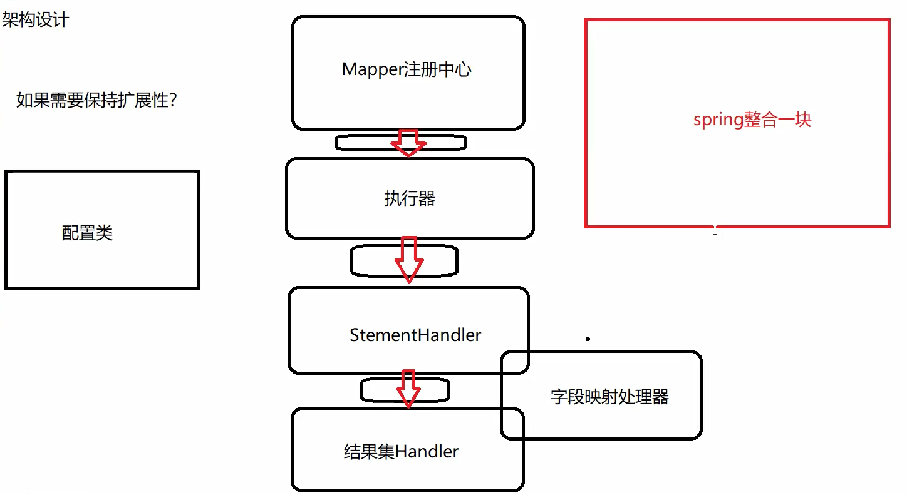
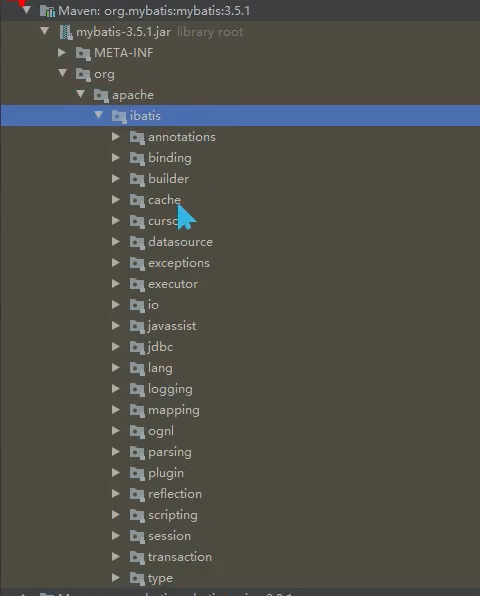
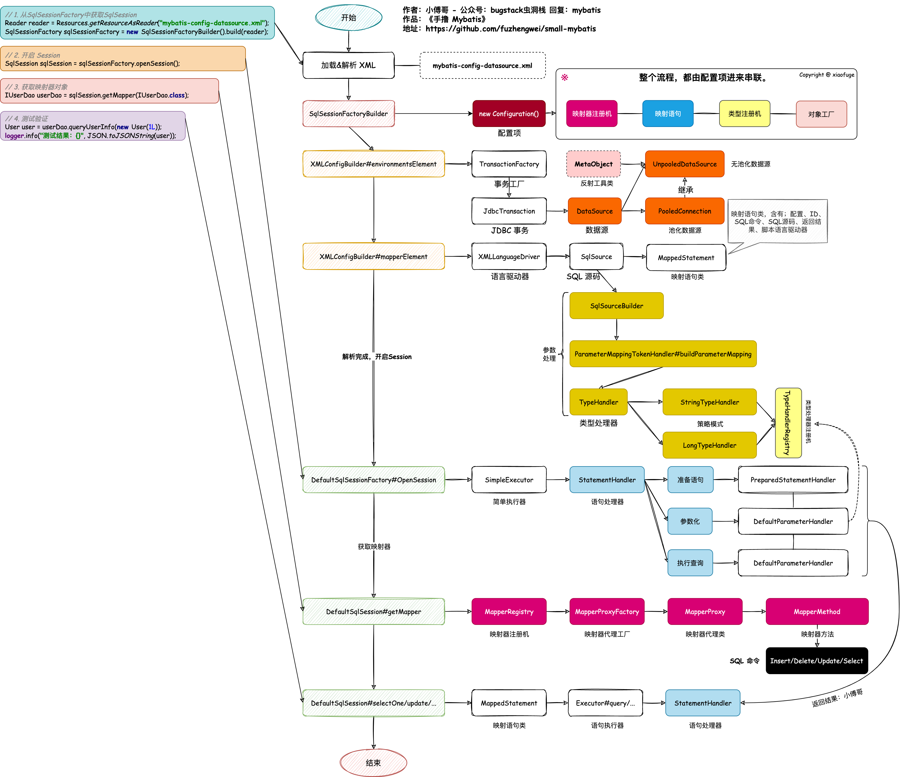

mybatis的学习记录

# 1.  Mapper ---->    仓库

     * 1.导入jdbc驱动包
     * 2.通过 DriverManager 注册驱动
     * 3.创建连接 ☆
     * 4.创建 Statement 对象  ☆
     * 5.CRUD ☆
     * 6.操作结果集  ☆
     * 7.关闭连接

接口 动态代理 实现

sql 解析
args 解析

# 2. 架构设计



如何设计？
如何写？
打开官网



### 看源码：先看接口

sqlSessionFactory //入口

sqlSession //封装对JDBC的增删改查

Closeable //try 关闭接口

ResultHandler // 结果集处理器

ResultContext // 结果集上下文

### 看完接口，看实现类（抽象类 屏蔽底层的细节-----构建者模式）

如何存取，如何读取，如何实现？


如何添加Mapper的 ？

Configuration 中的MapperRegistry 中存储着 执行addMapper方法存储

存储在MapperRegistry中使用Map存储HashMap<type,new MapperProxyFactory<>(type))；

使用mybatis要实现配置：mapperLocation

@Mapper注解实现扫描标注

将Mapper加入MapperRegistry

```java
/**
 * @Author ketty bluce
 * @Create 2023/5/24
 * @Version 1.0
 * 单线程的操作
 */
public class MybatisEnhance1 {
    private static int size = 10000000;
    private static Map<Object, Object> objectMap = new HashMap<>(size);
    @Data
    static class MapperScanner {
        private String mapperLocation;
        public List<Object> scanMapper() {
            List<Object> objects = Lists.newArrayList();
            for (int i = 0; i < size; i++) {
                objects.add(new Object());
            }
            return objects;
        }
    }
    public static void put(Object obj) {
        objectMap.put(obj, obj);
    }
    public static void main(String[] args) {
        String mapperLocation = "classpath:mapper/*/xml";
        MapperScanner mapperScanner = new MapperScanner();
        mapperScanner.setMapperLocation(mapperLocation);
        List<Object> objects = mapperScanner.scanMapper();
        long start = System.currentTimeMillis();
        objects.forEach(obj -> put(obj));
        long end = System.currentTimeMillis();
        System.out.println(end - start);
    }
}
```


# 3. 性能优化


MapperRegistry  实现 addMapper的功能

使用并行流添加

```java
public static void parallelSort(byte[] a) {
        int n = a.length, p, g;
        if (n <=  1 << 13 ||
            (p = ForkJoinPool.getCommonPoolParallelism()) == 1)
            DualPivotQuicksort.sort(a, 0, n - 1);
        else
            new ArraysParallelSortHelpers.FJByte.Sorter
                (null, a, new byte[n], 0, n, 0,
                 ((g = n / (p << 2)) <= 1 << 13) ?
                 1 << 13 : g).invoke();
}
```

参照这个方法进行实现性能优化


Configuration存放资源的类

BoundSql 绑定资源的类

executor = new CachingExecutor(executor);  // 门面模式

executor = (Executor) interceptorChain.pluginAll(executor); // 责任链模式


责任链模式

```

```





